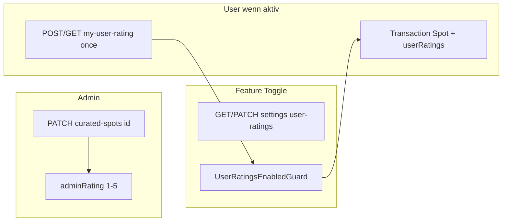

# Curated Spots: Admin-Bewertung und vorbereitete Nutzer-Bewertungen

## Kontext

- Kuratierte Spots liegen in Firestore [`curatedSpots`](src/curated-spots/infrastructure/persistence/firebase-curated-spot.repository.ts); Domain-Entity [`CuratedSpot`](src/curated-spots/domain/entities/curated-spot.entity.ts).
- Admin-Schreibzugriff erfolgt bereits über `PATCH /curated-spots/:id` mit `@Roles('admin', 'super_admin')` ([`curated-spots.controller.ts`](src/curated-spots/application/controllers/curated-spots.controller.ts)); das Modul importiert [`UsersModule`](src/curated-spots/curated-spots.module.ts) für den `RolesGuard` (gemäß [.cursorrules](.cursorrules)).
- Feature-Toggle-Muster im Projekt: eigenes Dokument unter `settings/<documentId>`, lesbar für alle authentifizierten User, Admin-Update per `PATCH`; bei deaktiviertem Feature blockiert ein Guard die Nutzung (vgl. [`DirectChatSettings`](src/direct-chats/infrastructure/persistence/firebase-direct-chat-settings.repository.ts) + [`DirectChatEnabledGuard`](src/direct-chats/application/guards/direct-chat-enabled.guard.ts) mit **503**).

## 1. Admin-Bewertung (1–5, nur Admin, **genau einmal**)

**Datenmodell**

- `adminRating: number | null` – 1–5, solange nie gesetzt `null`.
- `adminRatedAt: string | null` – ISO-Zeitpunkt; wird **genau dann** gesetzt, wenn `adminRating` zum ersten Mal gesetzt wird (bei `create` oder beim ersten relevanten `PATCH`), danach unverändert.
- Erweiterung von [`CuratedSpotProps`](src/curated-spots/domain/entities/curated-spot.entity.ts), `CuratedSpot`, `create`/`update`/`toJSON`.

**Regel Einmaligkeit**

- Sobald `adminRating` gesetzt ist (nicht `null`), lehnt [`CuratedSpotsService.update`](src/curated-spots/application/services/curated-spots.service.ts) jede weitere Änderung von `adminRating` (und jedes „Zurücksetzen“ auf `null`) mit **409 Conflict** ab. Optional dasselbe bei `create`, falls `adminRating` im Create-DTO mitgegeben wird und aus Versehen doppelt gesetzt würde – fachlich ist nur der erste gesetzte Wert relevant.

**API**

- [`UpdateCuratedSpotDto`](src/curated-spots/dto/update-curated-spot.dto.ts) / [`CreateCuratedSpotDto`](src/curated-spots/dto/create-curated-spot.dto.ts): optional `adminRating` mit `@IsInt()`, `@Min(1)`, `@Max(5)`; **`adminRatedAt` nie vom Client** – nur serverseitig.
- [`FirebaseCuratedSpotRepository.toProps`](src/curated-spots/infrastructure/persistence/firebase-curated-spot.repository.ts): beide Felder lesen (fehlend → `null`).

**Sicherheit**

- Nur Admin darf `PATCH /curated-spots/:id` (und Create) nutzen; normale User können `adminRating` nicht setzen.

## 2. Nutzer-Bewertungen (vorbereitet, Feature-Toggle)

**Settings (Toggle)**

- Neues Dokument z. B. `settings/curated_spots_user_ratings_settings` mit Feldern wie `isEnabled`, `updatedAt`, `updatedBy` (gleiches Schema-Pattern wie [`DirectChatSettings`](src/direct-chats/domain/entities/direct-chat-settings.entity.ts)).
- **Default:** `isEnabled: false`, damit das Feature ausgeliefert aber zunächst aus bleibt, bis Admin es aktiviert.
- Endpunkte (unter `curated-spots`, **vor** den generischen `/:id`-Routen registrieren, um Routing-Konflikte zu vermeiden):
  - `GET /curated-spots/settings/user-ratings` – jeder authentifizierte User (nur globaler `AuthGuard`, wie bei Direct Chat).
  - `PATCH /curated-spots/settings/user-ratings` – `@Roles('admin', 'super_admin')`, Body z. B. `{ isEnabled: boolean }`.

**Aggregation auf dem Spot**

- `userRatingAverage: number | null` und `userRatingCount: number` (Default 0 / null) in Entity + Repository-Mapping + Responses.
- Berechnung **nur beim ersten Vote** eines Users: `userRatingCount += 1`, neuer Durchschnitt = `(bisherigerSummand + score) / count` (numerisch stabil; bei `count === 0` Startwert für Durchschnitt = `score`). **Kein Update** eines bestehenden User-Votes – wiederholtes Speichern gibt **409**.

**Pro-User-Speicher**

- Subcollection: `curatedSpots/{spotId}/userRatings/{userId}` mit `{ score: 1–5, ratedAt: ISO-String }` – Dokument entsteht nur bei der **einmaligen** Abgabe.

**Neuer Anwendungs-Service**

- Z. B. `CuratedSpotUserRatingsService`: `getSettings`, `updateSettings`, `getMyRating(spotId, userId)`, `submitMyRatingOnce(spotId, userId, score)` mit **Firestore-Transaction**: User-Doc existiert bereits → **409**; sonst User-Doc anlegen (`ratedAt` = jetzt), Spot-Aggregat aktualisieren. Spot muss **ACTIVE und nicht gelöscht** sein ([`getByIdForApp`](src/curated-spots/application/services/curated-spots.service.ts)).

**Guard**

- Neuer Guard analog [`DirectChatEnabledGuard`](src/direct-chats/application/guards/direct-chat-enabled.guard.ts): bei `isEnabled === false` → **503** (`ServiceUnavailableException`) für Schreib- und Lese-Endpunkte der Nutzerbewertungen (einheitliches Verhalten wie Direct Chat).

**Endpunkte Nutzer**

- `GET /curated-spots/:id/my-user-rating` – `{ score, ratedAt }` oder `null`, wenn noch keine Abgabe (AuthGuard + Guard).
- `POST /curated-spots/:id/my-user-rating` (oder `PUT`, aber Semantik **create-only**) – Body `{ score: 1–5 }`; bei bereits existierender Bewertung **409** (AuthGuard + Guard + `@CurrentUser()`).

Diese Routen **vor** `GET /curated-spots/:id` im Controller platzieren.

## 3. Modul und Abhängigkeiten

- [`CuratedSpotsModule`](src/curated-spots/curated-spots.module.ts): neue Provider (Settings-Repository, Rating-Service), Guard registrieren; `UsersModule` bleibt für Admin-Routen nötig.

## 4. Tests (Pflicht laut [.cursorrules](.cursorrules))

- Unit-Tests: Aggregation nur bei erstem Vote; zweiter Submit gleicher User → 409; Settings-Service; Guard (enabled/disabled).
- Admin: erstes Setzen von `adminRating` setzt `adminRatedAt`; zweites PATCH mit anderem Wert → 409.
- Controller-Specs: User-Submit 503 wenn disabled; 409 wenn bereits bewertet; GET liefert `ratedAt`.

## 5. Dokumentation (bestehende Guides erweitern)

- [`docs/curated-spots-admin-integration.md`](docs/curated-spots-admin-integration.md): `adminRating`, `adminRatedAt`, Einmaligkeit (409); Settings-Route; Subcollection `userRatings` mit `ratedAt`; Aggregatfelder.
- [`docs/flutter-curated-spots-read-integration.md`](docs/flutter-curated-spots-read-integration.md): neue Spot-Felder; GET eigene Bewertung inkl. `ratedAt`; Submit nur einmal, **409** bei Duplikat; Feature-Flag.

**Push-Benachrichtigungen:** Für anonyme/editierte Spot-Bewertungen ist kein Versand vorgesehen (kein Nutzer-zu-Nutzer-Ereignis analog zu Chat); nicht Teil dieses Plans.

