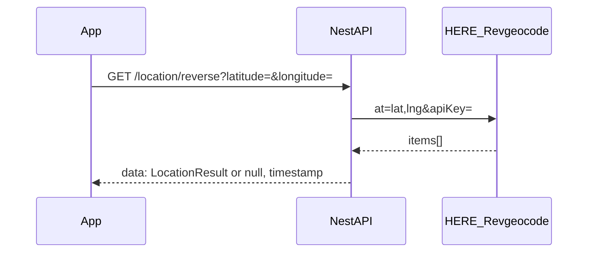

# HERE Reverse-Geocoding (Backend)

## Ausgangslage

- Vorwärtssuche: [`LocationController`](src/location/location.controller.ts) `GET /location/search?query=…` → [`LocationService.searchLocations`](src/location/services/location.service.ts) ruft `https://geocode.search.hereapi.com/v1/geocode` auf und gibt **HERE-`items` unverändert** zurück (Typ [`LocationResult`](src/location/interfaces/location-result.interface.ts)).
- Antwort-Envelope global: [`ResponseInterceptor`](src/core/interceptors/response.interceptor.ts) → `{ "data": …, "timestamp": "…" }`. Die Flutter-App soll `data` parsen (analog zu einem Element aus `data` bei der Suche).
- Credentials: wie heute `HERE_APP_ID` und `HERE_API_KEY` aus [`ConfigService`](src/location/services/location.service.ts); in der URL wird nur `apiKey` gesetzt – **gleiches Muster beibehalten** (inkl. Fehler, wenn Credentials fehlen).
- Deutschland-Filter: bestehendes Muster `countryCode === 'DE' || 'DEU'` auf die `items` anwenden.

## Implementierung

1. **DTO**  
   Neue Datei z. B. [`src/location/dto/location-reverse.dto.ts`](src/location/dto/location-reverse.dto.ts): Query-Parameter **`latitude`** und **`longitude`** (Konsistenz mit z. B. [`curated-spot-address.dto.ts`](src/curated-spots/dto/curated-spot-address.dto.ts)), `class-validator` (`@IsNumber`, sinnvolle `@Min`/`@Max` für Breiten-/Längengrad) und `class-transformer` `@Type(() => Number)`, damit Query-Strings zu Zahlen werden (analog zum bestehenden `@UsePipes(new ValidationPipe({ transform: true }))` am Such-Endpunkt).

2. **Service**  
   In [`location.service.ts`](src/location/services/location.service.ts) neue Methode z. B. `reverseGeocode(latitude: number, longitude: number): Promise<LocationResult | null>`:
   - URL: `https://revgeocode.search.hereapi.com/v1/revgeocode`
   - Query: `at=${latitude},${longitude}`, `apiKey` wie bei der Geocode-Suche.
   - Optional sinnvoll: denselben räumlichen Fokus wie die Vorwärtssuche, z. B. `in=countryCode:DEU` (HERE unterstützt das bei Revgeocode; reduziert Ausreißer außerhalb DE). Falls die API ohne `in` stabiler ist, kann zunächst nur der **post-hoc-Filter** wie bei `searchLocations` genutzt werden – minimal und konsistent mit dem bestehenden Code.
   - Response wie [`HereApiResponse`](src/location/interfaces/here-api-response.interface.ts) parsen; **erstes Item**, das den Deutschland-Filter erfüllt, zurückgeben, sonst **`null`** (leeres `items` oder nur Nicht-DE → `null`).
   - Fehlerbehandlung: gleiches Muster wie `searchLocations` (`response.ok`, Logging, werfen bei Netzwerk/HTTP-Fehler).

3. **Controller**  
   In [`location.controller.ts`](src/location/location.controller.ts): `GET /location/reverse` mit `@Query() dto: LocationReverseDto`, `ValidationPipe({ transform: true })`, Rückgabetyp **`LocationResult | null`** (wird zu `data: null` im Envelope).

4. **Tests** (gemäß [`.cursorrules`](.cursorrules))  
   - [`location.service.spec.ts`](src/location/services/location.service.spec.ts): Erfolg mit einem DE-Item, leeres Ergebnis → `null`, Mischung DE/AT → nur DE, fehlende Credentials, `!response.ok`, `fetch` wirft.
   - [`location.controller.spec.ts`](src/location/location.controller.spec.ts): Aufruf mit DTO, Delegation an Service, Fehlerweitergabe.

5. **Dokumentation**  
   Neue kurze Datei unter [`docs/`](docs/), z. B. `location-api.md`: beide Routen (`/location/search`, `/location/reverse`), Query-Parameter, Envelope `{ data, timestamp }`, Bedeutung von `data: null`, Verweis auf HERE Revgeocode. **Hinweis für die App** (wie von dir gewünscht): Koordinaten aus dem Long-Press sind die **Quelle der Wahrheit** für `CuratedSpotAddress.latitude`/`longitude`; HERE liefert nur Textfelder – verhindert Pin-Verschiebung bei kleinen HERE-Abweichungen. Optional einen Satz Verweis von [`flutter-curated-spots-create-integration.md`](docs/flutter-curated-spots-create-integration.md) auf diese Doku (nur wenn du die Querverbindung explizit willst; sonst reicht die neue Datei).

## Flutter-Seite (nur zur Abstimmung, kein Backend-Code)

- Response: `HereLocationResult.fromJson(response['data'] as Map<String, dynamic>)` mit Null-Check, wenn `data == null`.
- Kein neues Mapping nötig, solange das Backend **dieselben HERE-Felder** wie ein `items[]`-Eintrag der Geocode-Suche durchreicht.

