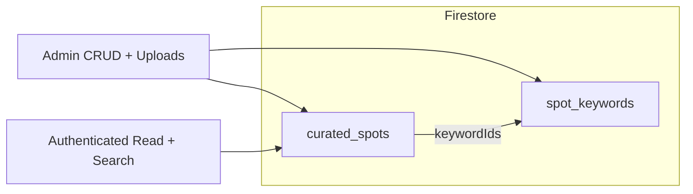

# Kuratierte Spots (Backend)

## Kontext aus dem Code

- **Businesses/Partner** nutzen bereits `keywordIds` und die Collection `keywords` ([`src/businesses/domain/entities/business.entity.ts`](src/businesses/domain/entities/business.entity.ts), [`src/businesses/application/services/businesses.service.ts`](src/businesses/application/services/businesses.service.ts)). Ihr wollt **kein** gemeinsames Vokabular – daher **keine** Wiederverwendung der bestehenden [`KeywordsModule`](src/keywords/keywords.module.ts)-Collection `keywords`.
- **Rollen**: [`UserType`](src/users/enums/user-type.enum.ts) + [`RolesGuard`](src/core/guards/roles.guard.ts) arbeiten mit String-Rollen wie `'admin'`, `'super_admin'` (Vorbild: [`taxi-stands.controller.ts`](src/taxi-stands/application/controllers/taxi-stands.controller.ts)). **Schreibende Endpunkte** mit `@UseGuards(RolesGuard)` und `@Roles('admin', 'super_admin')`.
- **Architektur & Firebase**: An [docs/architecture.md](docs/architecture.md) und die Firebase-Hinweise dort anlehnen; `removeUndefined` vor Writes wie in bestehenden Repos ([`firebase-business.repository.ts`](src/businesses/infrastructure/persistence/firebase-business.repository.ts)).
- **Projektregeln**: [.cursorrules](.cursorrules) (Domain-Entity-Pattern, Tests, englische Code-Kommentare/JSDoc, `UsersModule`-Import wenn `RolesGuard` genutzt wird – siehe [`taxi-stands.module.ts`](src/taxi-stands/taxi-stands.module.ts)).

## Keyword-IDs vs. „Biergarten“ / „Klimaanlage“ (für die Suche)

- **`keywordIds`** sind die **Firestore-Dokument-IDs** der Einträge in der Collection `spot_keywords` (technische Referenzen, z. B. `aB3cD9...`). Auf jedem Keyword-Dokument liegt das, was Nutzer sehen: **`name`** = z. B. `"Biergarten"` oder `"Klimaanlage"`.
- **Auf dem Spot** werden nur diese IDs gespeichert (`keywordIds: string[]`), damit Referenzen stabil bleiben und Firestore-Queries wie `array-contains` mit einer eindeutigen ID funktionieren (Namensänderungen am Keyword optional möglich, ohne alle Spots neu zu schreiben – je nach späterer Produktregel).
- **Suche in der App für Endnutzer**: Nutzer tippen den **Namen**, nicht die ID. Typischer Ablauf: (1) `GET /spot-keywords/suggest?q=bier` liefert passende Keyword-Dokumente inkl. `id` und `name`; (2) Nutzer wählt ein oder mehrere Keywords (z. B. „Biergarten“ und „Klimaanlage“); (3) die App ruft die Spot-Suche mit **mehreren IDs** auf, z. B. wiederholter Query-Parameter `keywordIds=<id1>&keywordIds=<id2>` oder komma-separiert – konkrete Form in der Implementierung festlegen und in der Client-Doku festhalten. **Semantik: immer UND** – es werden nur Spots geliefert, die **alle** übergebenen Keyword-IDs besitzen (kein ODER-Modus, kein `keywordMatch`-Parameter).
- Kurz: **IDs für Persistenz und Firestore-Filter; Namen für UI und Autocomplete; Mehrfachauswahl = alle gewählten Tags müssen zutreffen.**

## Abgleich mit den Architektur-Mustern im Repo

- Der Plan folgt dem in [docs/architecture.md](docs/architecture.md) beschriebenen **Schichtenmodell** (Domain-Entity, Application-Services, Firebase-Infrastruktur, `removeUndefined`) und der **bestehenden Modul-Praxis** wie bei [`src/businesses/`](src/businesses/) und [`src/taxi-stands/`](src/taxi-stands/) (Controller + Service + Firebase-Repository, optional Repository-Port als Interface).
- Abweichung von einer „reinen“ Hexagon-Form: Nicht jedes bestehende Modul trennt strikt alle Ports; das neue Modul soll **dieselbe pragmatische Tiefe** wie Taxi Stands / Businesses nutzen, damit es konsistent bleibt und wartbar ist.

## Zielmodell

### Collection `spot_keywords`

- Felder z. B.: `id`, `name` (Anzeige), `nameLower` (normalisiert für Präfix-Suche, z. B. `trim().toLowerCase()`), `createdAt`, `updatedAt`.
- **Kein Pflichtfeld `description`** (im Gegensatz zu [`CreateKeywordDto`](src/keywords/dto/create-keyword.dto.ts) bei globalen Keywords), damit Tags frei anlegbar sind.
- **Anlegen**: explizit per Admin-API und/oder **implizit** beim Speichern eines Spots, wenn der Client neue Namen mitsendet (Server dedupliziert über `nameLower`, legt fehlende Docs an, gibt IDs zurück).

### Collection `curated_spots`

- Pflicht/kerne: `name`, `nameLower` (für Präfix-Suche), `descriptionMarkdown` (roher Markdown-String; Rendering bleibt Client-Sache), `imageUrls` (Array, URLs nach Upload), `keywordIds` (String-Array, **ohne harte Obergrenze** in der API-Validierung).
- Optional: `videoUrl`, `instagramUrl` (URLs mit `class-validator`, optional).
- Metadaten: `status` (analog [`BusinessStatus`](src/businesses/domain/enums/business-status.enum.ts): mindestens `PENDING` und `ACTIVE`, damit „kuratiert“ später sichtbar geschaltet werden kann), `isDeleted`, `createdAt`, `updatedAt`, optional `createdByUserId` (Firebase-UID aus Request).
- **Medien**: wie bei Businesses – [`FirebaseStorageService`](src/firebase/firebase-storage.service.ts) + `FilesInterceptor` auf Unterpfaden z. B. `curated-spots/{id}/images/...` (analog [`businesses.controller.ts`](src/businesses/application/controllers/businesses.controller.ts)).

## API-Skizze (Nest)

| Bereich | Beispiel | Rolle |
|--------|-----------|--------|
| Öffentlich in der App (alle authentifizierten User wie üblich) | `GET /curated-spots`, `GET /curated-spots/:id`, `GET /curated-spots/search?...` (u. a. mehrere `keywordIds`, **nur UND**) | Kein `@Roles` auf Lesendem, nur Auth |
| Admin | `POST/PATCH/DELETE /curated-spots`, Bild-Uploads, Status setzen | `@Roles('admin', 'super_admin')` |
| Keywords | `GET /spot-keywords/suggest?q=` (Präfix über `nameLower`), `GET /spot-keywords` (optional paginiert), `POST /spot-keywords` (Admin) | Vorschlag lesend für authentifizierte User möglich, Schreiben Admin |

**Suche**: Firestore erlaubt keine Volltextsuche. Pragmatischer Ansatz (wie in vielen Firebase-Backends):

- Filter **Name**: Query mit Präfix auf `nameLower` (`>= prefix` und `< prefix + '\uf8ff'`), `status == ACTIVE` (ggf. `isDeleted == false`).
- Filter **ein Keyword**: `where('keywordIds','array-contains', id)` + `ACTIVE` (wie bisher geplant).
- Filter **mehrere Keywords gleichzeitig – ausschließlich UND**: Es werden nur Spots geliefert, deren `keywordIds` **alle** angefragten IDs enthalten. Firestore erlaubt **nicht** mehrere `array-contains` mit unterschiedlichen Werten in **einer** Query. Umsetzung: **eine** `array-contains`-Query mit einem der angefragten Keywords (z. B. das erste), danach im **Service** nachfiltern mit `requestedKeywordIds.every(id => spot.keywordIds.includes(id))`. Alternative Einstiegspunkte: bei gesetztem Namens-Präfix zuerst Namens-Query, dann UND-Keyword-Check im Service. Bei wachsender Datenmenge später optimieren (z. B. invertierter Index `spot_keywords/{id}/spots` und Schnittmengen – optional auslagern). **Kein ODER-Modus**, kein `array-contains-any` für diese Anforderung.
- **Kombination Name + mehrere Keywords (UND)**: z. B. Firestore nach Name-Präfix **oder** nach einem Keyword einschränken, dann im Service sicherstellen, dass **alle** weiteren Keyword-IDs und ggf. der Name passen; ggf. Composite-Index in der Firebase-Konsole, sobald die finale Query feststeht.

## Modul-Struktur (an bestehende Features angelehnt)

Neues Modul z. B. [`src/curated-spots/`](src/curated-spots/) (oder aufgeteilt in `curated-spots` + `spot-keywords`, falls ihr die Dateigröße begrenzen wollt):

- `domain/entities/curated-spot.entity.ts`, `domain/enums/curated-spot-status.enum.ts`
- `domain/repositories/*.repository.ts` (Ports)
- `infrastructure/persistence/firebase-*.repository.ts`
- `application/services/curated-spots.service.ts`, `spot-keywords.service.ts`
- `application/controllers/curated-spots.controller.ts`, `spot-keywords.controller.ts` (oder ein Controller mit sauberen Pfad-Prefixen – wichtig: **statische Routen** wie `search` und `suggest` vor `:id` registrieren)
- DTOs mit `class-validator`
- [`app.module.ts`](src/app.module.ts): Modul registrieren
- **Tests** (Pflicht laut [.cursorrules](.cursorrules)): Service-Specs (Happy Path, Validierung, Suche, Status), Controller-Specs mit gemockten Services; Keyword-Suggest und „Keyword beim Spot-Speichern anlegen“.

## Abgrenzung / später

- **Content-Creator-Rolle** in der API: aktuell **nicht** vorgesehen (eure Entscheidung); später könnt ihr dieselbe Domain nutzen und `@Roles` oder ein Profil-Flag ergänzen.
- **Push-Benachrichtigungen**: nur falls ihr bei Veröffentlichung `ACTIVE` Nutzer informieren wollt – aktuell nicht zwingend; falls doch: [.cursorrules](.cursorrules) Notification-Pattern + Tests.

## Dokumentation im Repo

- Technische Details für die **Flutter-/Admin-App** optional als neues Kapitel oder Datei unter `docs/` (analog [docs/taxi-stands-app-integration.md](docs/taxi-stands-app-integration.md)); bestehende [README.md](README.md) nur bei Bedarf um einen Absatz „Curated Spots“ ergänzen, falls ihr Endpunkt-Übersichten dort pflegt.
