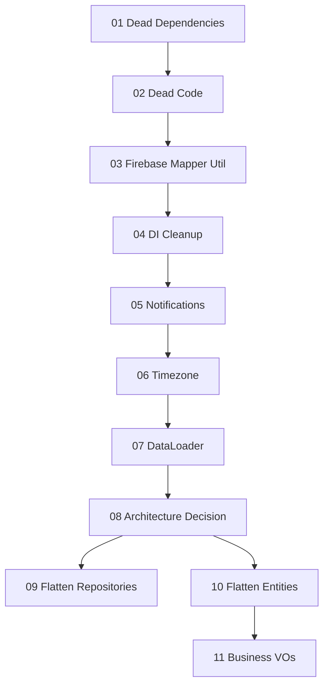

# Ponytail Audit – Übersicht & Roadmap

Quelle: Repo-weiter Ponytail-Audit (2026-06-20). Fokus: Over-Engineering reduzieren, keine Bugfixes/Security/Performance.

## Geschätzter Impact

| Kategorie | Zeilen | Dependencies |
|-----------|--------|--------------|
| Sichere Schnitte (Phase 1–2) | ~550 | −6 |
| Mittlere Refactors (Phase 3–7) | ~500 | −1 |
| Große Architektur-Umbauten (Phase 8–11) | ~5.400 | 0 |

## Empfohlene Reihenfolge

Jede Phase ist ein eigener Plan. Phasen innerhalb einer Gruppe können parallelisiert werden; große Architektur-Phasen erst nach den sicheren Schnitten.

### Gruppe A – Sofort, risikoarm

| # | Plan | Aufwand | Impact |
|---|------|---------|--------|
| 1 | [01-dead-dependencies](./ponytail-audit-01-dead-dependencies.plan.md) | S | −6 deps |
| 2 | [02-dead-code](./ponytail-audit-02-dead-code.plan.md) | S | ~−400 LOC |
| 3 | [03-firebase-mapper-util](./ponytail-audit-03-firebase-mapper-util.plan.md) | M | ~−300 LOC |

### Gruppe B – Inkrementell, moderates Risiko

| # | Plan | Aufwand | Impact |
|---|------|---------|--------|
| 4 | [04-di-cleanup](./ponytail-audit-04-di-cleanup.plan.md) | S | weniger Boilerplate |
| 5 | [05-notifications-simplify](./ponytail-audit-05-notifications-simplify.plan.md) | S | ~−90 LOC |
| 6 | [06-timezone-strategy](./ponytail-audit-06-timezone-strategy.plan.md) | M | Konsistenz |
| 7 | [07-dataloader](./ponytail-audit-07-dataloader.plan.md) | M | −1 dep |

### Gruppe C – Architektur-Entscheidung nötig

| # | Plan | Aufwand | Impact |
|---|------|---------|--------|
| 8 | [08-architecture-decision](./ponytail-audit-08-architecture-decision.plan.md) | S (Entscheidung) | Richtung festlegen |
| 9 | [09-flatten-repositories](./ponytail-audit-09-flatten-repositories.plan.md) | XL | ~−2.800 LOC |
| 10 | [10-flatten-entities](./ponytail-audit-10-flatten-entities.plan.md) | XL | ~−2.300 LOC |
| 11 | [11-business-value-objects](./ponytail-audit-11-business-value-objects.plan.md) | M | ~−150 LOC |

**Aufwand:** S = < 1h, M = halber Tag, L = 1–2 Tage, XL = mehrere Tage (modulweise)

## Validierung nach jeder Phase

```bash
npm run lint
npm run format:check
npx tsc --noEmit
npm test
npm run build
npm run start:dev   # Nest bootstrap ohne DI-Fehler; danach beenden
```

## Abhängigkeiten zwischen Phasen



## Referenzen

- `docs/architecture.md` – hexagonale Architektur (aktueller Soll-Zustand)
- `docs/brainstorming-performance-und-features.md` – bereits identifizierte tote deps (`date-fns`)
- `.cursorrules` – Firebase `removeUndefined`-Pattern, Test-Pflicht
