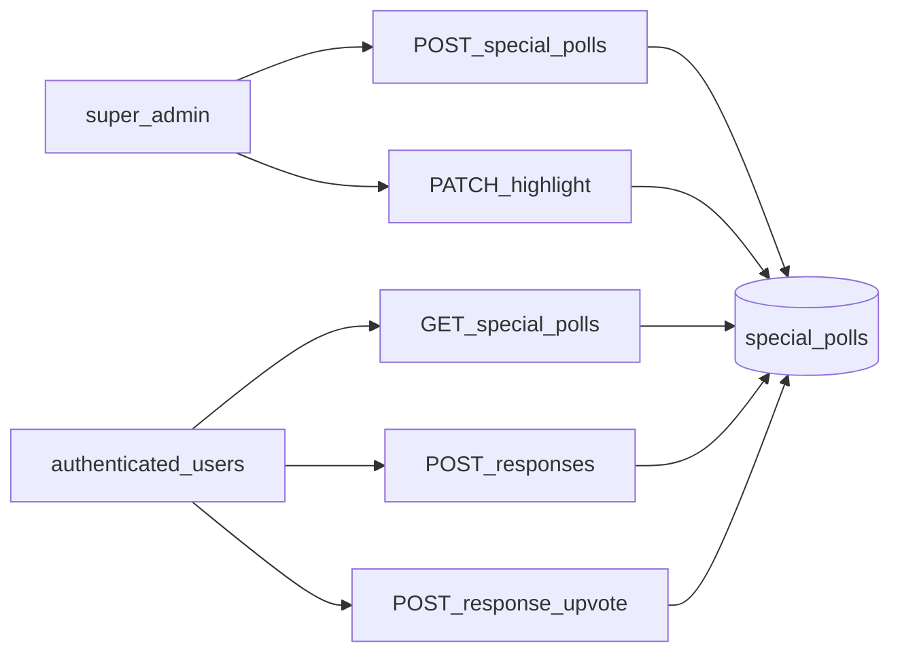

# Special Polls: Highlight, Legacy-Status CLOSED, Upvotes

## Ausgangslage (Code)

- Modul: [`src/special-polls/`](src/special-polls/) – Firestore-Collection `special_polls`.
- Lesen: `GET /special-polls` und `GET /special-polls/:id` mit `@Roles('user', 'admin', 'super_admin')` – alle authentifizierten Nutzer (inkl. anonym, laut [.cursorrules](.cursorrules)) können Umfragen inkl. eingebetteter `responses` abrufen; Antworten sind damit **bereits „direkt sichtbar“** im Poll-JSON.
- Antworten: `POST /special-polls/:id/responses` – aktuell nur bei `status === ACTIVE` ([`addResponse`](src/special-polls/special-polls.service.ts)); das widerspricht „Antworten zu allen Fragen“.
- **Hervorhebung:** Im Domain-Modell gibt es nur `title`, `responses`, `status`, Zeitstempel – **kein** Highlight-Flag ([`SpecialPoll`](src/special-polls/interfaces/special-poll.interface.ts)).
- **Upvotes:** Nicht vorhanden; [`SpecialPollResponse`](src/special-polls/interfaces/special-poll.interface.ts) hat nur `userId`, `userName`, `response`, `createdAt`.
- Super-Admin-only: `POST` (Create), `PATCH :id/status`, `PATCH :id/responses`, `DELETE :id` ([Controller](src/special-polls/special-polls.controller.ts)).
- Dokumentation im Repo zu Notifications: [docs/notification-suggestions.md](docs/notification-suggestions.md) (NEW_SURVEY / `SpecialPollsService.create`) – bei Schema-Erweiterung ggf. Swagger/Doku um `isHighlighted` ergänzen, **keine** neue Markdown-Datei anlegen, sofern nicht ausdrücklich gewünscht (User-Regel „keine Docs ohne Auftrag“).

## Zielbild

- **Status `CLOSED` nur noch Legacy (Rückwärtskompatibilität):** In Firestore existieren bereits Dokumente mit `status: 'CLOSED'`. **Kein hartes Entfernen** dieses Werts aus dem Lesepfad: `findAll` / `findOne` (und jede andere Auslieferung) sollen eine **zentrale Normalisierung** anwenden, z. B. `CLOSED` für API- und Geschäftslogik wie `ACTIVE` behandeln (oder explizit auf `ACTIVE` mappen), sodass bestehende Daten **ohne einmalige Migration** weiter funktionieren. Optional später: Batch-Migration in Firestore, ist aber **nicht Voraussetzung**, solange Lesen/Schreiben kompatibel ist.
- **Schreib-API ohne `CLOSED`:** `UpdateSpecialPollStatusDto` / Super-Admin-Status-Patch dürfen **`CLOSED` nicht mehr als gültigen neuen Wert** akzeptieren (nur noch `PENDING` / `ACTIVE` o. Ä.), damit keine neuen CLOSED-Dokumente entstehen. Beim **Update** eines Legacy-Dokuments kann ein Patch auf `ACTIVE` den Wert in Firestore überschreiben.
- **Highlight:** Neues Feld `isHighlighted: boolean` (Default `false` bei Create); Super-Admin setzt es per dediziertem `PATCH` (z. B. `PATCH /special-polls/:id/highlight` mit Body `{ isHighlighted: boolean }`) oder Erweiterung des bestehenden Status-Patches – empfehlenswert ist ein **eigenes, sprechendes Endpoint**, damit „Hervorheben“ nicht mit `PENDING`/`ACTIVE` vermischt wird. Optional: Query `GET /special-polls?highlighted=true` für die App – nur wenn die Flutter-Seite das so braucht; sonst reicht Filtern clientseitig.
- **Antworten immer erlauben:** In [`addResponse`](src/special-polls/special-polls.service.ts) die Prüfung `poll.status !== ACTIVE` entfernen; **nach Normalisierung** gilt Legacy-`CLOSED` wie ein beantwortbarer Zustand (kein Blockieren wegen Alt-String in der DB). **`PATCH :id/responses` (Super-Admin)** bleibt für Moderation/Korrektur getrennt.
- **Upvotes:** Pro Antwort eine **stabile `id`** (z. B. `crypto.randomUUID()` beim Anlegen in `addResponse`), damit Upvotes nicht über Array-Indizes laufen. Feld z. B. `upvotedUserIds: string[]` (eindeutig pro Nutzer; Toggle: wenn bereits enthalten, entfernen = „Downvote“/Zurücknehmen) oder separates `POST`/`DELETE` – ein Endpoint `POST /special-polls/:id/responses/:responseId/upvote` mit Toggle ist für Mobile-Clients oft am einfachsten. Validierung: nur authentifizierter User, keine Upvotes auf fremde Identität.
- **Backward compatibility (Antworten/Upvotes):** Alte Dokumente ohne `response.id` / ohne `upvotedUserIds`: beim nächsten `addResponse` oder in einer Hilfsfunktion beim Lesen fehlende IDs bzw. leere Upvote-Arrays nachziehen, damit der Upvote-Endpoint stabil bleibt.

## Rückwärtskompatibilität `CLOSED` (Pflicht)

| Aspekt | Vorgehen |
|--------|----------|
| Lesen aus Firestore | Rohdaten können `CLOSED` enthalten; vor Rückgabe an Client / vor Domain-Logik **normalisieren** (ein Ort im Service, keine verstreuten `if (status === 'CLOSED')`). |
| TypeScript-Typ | Entweder Union-Typ inkl. Legacy-Literal `'CLOSED'` nur für Rohdaten, oder String + Normalisierung zu den „aktuellen“ Statuswerten; vermeidet kaputte Deserialisierung. |
| Neue Status-Updates | Validator: kein `CLOSED` mehr; verhindert neues Anlegen des Zustands. |
| Tests | Mindestens ein Test mit Roh-`CLOSED` aus der DB: GET liefert konsistentes Verhalten; `addResponse` / Upvotes funktionieren wie nach Produktvorgabe. |

## Testpflicht (laut .cursorrules)

- [`special-polls.service.spec.ts`](src/special-polls/special-polls.service.spec.ts): neue Pfade (Highlight-Update, Upvote-Toggle, **Legacy `CLOSED`-Dokumente**, normalisierte Ausgabe, `addResponse` ohne alte ACTIVE-Sperre, fehlende `response.id`).
- [`special-polls.controller.spec.ts`](src/special-polls/special-polls.controller.spec.ts): neue/gewandelte Routen und Rollen (`super_admin` vs `user`).

## Kurzantwort auf „Gibt es Fragen?“

- **Fachlich:** Mit Ihrer Klarstellung („kein CLOSED, nur highlighted/nicht“) sind die Hauptfragen geklärt. Offen bleibt nur ein Feinheit (optional): Soll **`PENDING`** weiterhin existieren (Entwurf, ggf. ohne Push/ohne Listung in der App), oder sollen neue Umfragen **sofort „live“** sein und nur über `isHighlighted` gesteuert werden? Das beeinflusst, ob `addResponse` bei `PENDING` erlaubt sein soll und ob Notifications erst bei „Veröffentlichen“ kommen – kann im Implementierungsschritt mit Ihnen in einem Satz entschieden werden.
