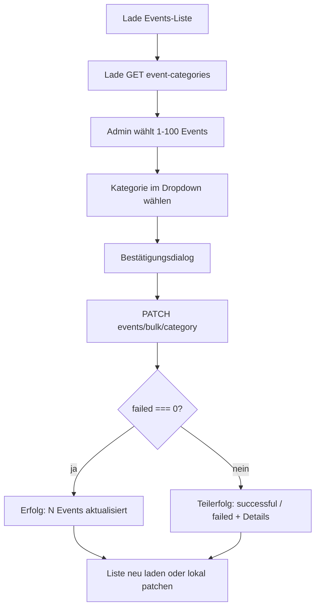

# Events Bulk-Kategorie-Update – Admin-Frontend Integration

Agent-optimierte Anleitung zur Implementierung der Bulk-Kategorie-Zuweisung im Admin-Frontend. Vollständige Backend-Regeln: [events-api.md](events-api.md).

## Agent Task Scope

**Ziel:** Admin-UI, in der Nutzer mit Rolle `admin` oder `super_admin` mehrere Events auswählen und **einer gemeinsamen Kategorie** zuweisen.

**Ein API-Call:** `PATCH /events/bulk/category`

**Nicht im Scope:** Andere Event-Felder per Bulk ändern; einzelnes `PATCH /events/:id` für Kategorie-Bulk ersetzen.

---

## Globale Voraussetzungen

| Thema | Wert |
|-------|------|
| Auth-Header | `Authorization: Bearer <FirebaseIdToken>` auf **jeder** Anfrage |
| Erlaubte Rollen | `userType` im Firestore-Profil: `admin` oder `super_admin` |
| Base-URL | `{BASE_URL}/events/...` — Präfix `/dev` oder `/prd` je nach Umgebung (siehe [README.md](../README.md)) |
| Response-Envelope | Alle Erfolgsantworten: `{ data: T, timestamp: string }` — Client nutzt **`response.data`** |
| Fehler-Envelope | `{ statusCode, timestamp, message }` |

Technische Details zum Guard: [.cursorrules](../.cursorrules), [`src/core/guards/roles.guard.ts`](../src/core/guards/roles.guard.ts).

---

## TypeScript-Typen (1:1 mit Backend)

```typescript
/** Request-Body für PATCH /events/bulk/category */
export interface BulkUpdateEventCategoryRequest {
  eventIds: string[];   // 1–100 IDs, nicht leer
  categoryId: string;   // Firestore-ID aus event_categories
}

/** Einzelergebnis pro Event */
export interface BulkUpdateEventCategoryItemResult {
  eventId: string;
  success: boolean;
  event?: Event;        // bei success: true — aktualisiertes oder unverändertes Event
  message?: string;     // bei success: false — z.B. "Event not found"
}

/** Gesamtergebnis (liegt in response.data) */
export interface BulkUpdateEventCategoryResult {
  total: number;
  successful: number;
  failed: number;
  results: BulkUpdateEventCategoryItemResult[];
}

export interface EventCategory {
  id: string;
  name: string;
  description: string;
  colorCode: string;
  iconName: string;
  fallbackImages?: string[];
  createdAt: string;
  updatedAt: string;
}

export interface Event {
  id: string;
  status?: 'ACTIVE' | 'PENDING';
  title: string;
  description: string;
  categoryId: string;
  location: { address: string; latitude: number; longitude: number };
  createdAt: string;
  updatedAt: string;
  // … weitere optionale Felder siehe Backend Event-Interface
}

export interface ApiSuccessEnvelope<T> {
  data: T;
  timestamp: string;
}

export interface ApiErrorEnvelope {
  statusCode: number;
  timestamp: string;
  message: string | string[];
}
```

Backend-Quellen:

- [`src/events/dto/bulk-update-event-category.dto.ts`](../src/events/dto/bulk-update-event-category.dto.ts)
- [`src/events/dto/bulk-update-event-category-result.dto.ts`](../src/events/dto/bulk-update-event-category-result.dto.ts)
- [`src/events/interfaces/event.interface.ts`](../src/events/interfaces/event.interface.ts)

---

## Endpunkte

### 1. Kategorien laden (Dropdown / Picker)

```
GET {BASE_URL}/event-categories
```

| | |
|---|---|
| Auth | Firebase-Token (keine Admin-Rolle nötig) |
| Response | `data: EventCategory[]` |
| UI | `categoryId` = `EventCategory.id`, Anzeige = `name` (+ optional `colorCode`, `iconName`) |

### 2. Events laden (Auswahl-Liste)

Je nach Admin-Ansicht:

| Zweck | Endpoint | Hinweis |
|-------|----------|---------|
| Freigegebene Events | `GET {BASE_URL}/events` | Nur `ACTIVE` / Legacy ohne `status` |
| Pending-Freigaben | `GET {BASE_URL}/events/pending` | Nur Admin; `status: PENDING` |
| Gemischt / Detail | `GET {BASE_URL}/events/:id` | Admin sieht auch Pending |

Bulk-Update funktioniert für **ACTIVE und PENDING** — beide Status sind erlaubt.

Siehe auch [events-pending-admin-integration.md](events-pending-admin-integration.md).

### 3. Bulk-Kategorie-Update (Hauptaktion)

```
PATCH {BASE_URL}/events/bulk/category
Content-Type: application/json
Authorization: Bearer <token>
```

**Request-Body:**

```json
{
  "eventIds": ["abc123", "def456"],
  "categoryId": "konzerte-firestore-id"
}
```

**Erfolgs-Response (HTTP 200):**

```json
{
  "data": {
    "total": 2,
    "successful": 2,
    "failed": 0,
    "results": [
      {
        "eventId": "abc123",
        "success": true,
        "event": { "id": "abc123", "categoryId": "konzerte-firestore-id", "title": "…" }
      },
      {
        "eventId": "def456",
        "success": true,
        "event": { "id": "def456", "categoryId": "konzerte-firestore-id", "title": "…" }
      }
    ]
  },
  "timestamp": "2026-06-18T19:40:00.000+02:00"
}
```

**Teilerfolg (HTTP 200):** `failed > 0`, einzelne `results[].success === false` — Request gilt als erfolgreich, UI muss Teilerfolg anzeigen.

---

## Fehler-Matrix

| HTTP | Ursache | Client-Verhalten |
|------|---------|------------------|
| **401** | Kein/ungültiges Token | Re-Login |
| **403** | Kein Admin/Super-Admin | Aktion ausblenden oder „Keine Berechtigung“ |
| **400** | Ungültige `categoryId`, leeres `eventIds`, >100 IDs, Validierungsfehler | Gesamten Request ablehnen; Fehlermeldung aus `message` |
| **200** + `failed > 0` | Einzelne Event-IDs unbekannt | Teilerfolg-Dialog; erfolgreiche Einträge in lokaler Liste aktualisieren |

**Wichtig:** Ungültige `categoryId` → **gesamter Request scheitert** (400), bevor Events angefasst werden.

**Bekannte Item-Messages:**

- `"Event not found"` — ID existiert nicht in Firestore

**Idempotenz:** Event hat bereits Ziel-`categoryId` → `success: true`, kein Firestore-Write, `event` unverändert.

**Duplikate:** `["a","a","b"]` → serverseitig dedupliziert zu `["a","b"]`.

---

## Referenz-Client (TypeScript)

```typescript
async function bulkUpdateEventCategory(
  baseUrl: string,
  token: string,
  payload: BulkUpdateEventCategoryRequest,
): Promise<BulkUpdateEventCategoryResult> {
  const res = await fetch(`${baseUrl}/events/bulk/category`, {
    method: 'PATCH',
    headers: {
      'Content-Type': 'application/json',
      Authorization: `Bearer ${token}`,
    },
    body: JSON.stringify(payload),
  });
  if (!res.ok) {
    const err = (await res.json()) as ApiErrorEnvelope;
    const msg = Array.isArray(err.message) ? err.message.join(', ') : err.message;
    throw new Error(`Bulk update failed (${res.status}): ${msg}`);
  }
  const envelope = (await res.json()) as ApiSuccessEnvelope<BulkUpdateEventCategoryResult>;
  return envelope.data;
}
```

---

## Empfohlener UI-Flow



### UI-Regeln

| Regel | Detail |
|-------|--------|
| Sichtbarkeit | Bulk-Aktion nur bei `userType === 'admin' \|\| 'super_admin'` |
| Auswahl-Limit | Max. **100** Events pro Request — UI vor Submit prüfen |
| Button-State | Deaktiviert wenn `eventIds.length === 0` oder keine Kategorie gewählt |
| Gleiche Kategorie | Wenn alle selektierten Events bereits `categoryId` haben → Hinweis „bereits zugewiesen“, Submit optional trotzdem möglich (idempotent) |
| Nach Erfolg | Lokale Liste: `event.categoryId` aus `results[].event` patchen **oder** Liste neu laden |
| Teilerfolg | Tabelle: Event-Titel + `message` für fehlgeschlagene Zeilen |
| Pending-Events | Erlaubt — kein separates Approve nötig |

---

## Lokales State-Update nach Erfolg

```typescript
function applyBulkCategoryResult(
  events: Event[],
  result: BulkUpdateEventCategoryResult,
): Event[] {
  const updatedById = new Map(
    result.results
      .filter((r) => r.success && r.event)
      .map((r) => [r.eventId, r.event!]),
  );
  return events.map((e) => updatedById.get(e.id) ?? e);
}
```

Kategorie-Name in der UI: über `categories.find(c => c.id === event.categoryId)?.name`.

---

## Nebenwirkungen (kein Frontend-Handling nötig)

- Öffentliche Events (`ACTIVE` oder ohne `status`): Backend kann **`FAV_EVENT_UPDATE`** Push mit `updateType: "OTHER"` auslösen.
- Pending-Events: **keine** Favoriten-Benachrichtigung.
- Kein Event-Cache serverseitig — nach Update sind Änderungen sofort in `GET /events` sichtbar.

---

## Abgrenzung zu anderen Endpunkten

| Endpoint | Wann nutzen |
|----------|-------------|
| `PATCH /events/bulk/category` | Mehrere Events → **eine** Kategorie (Admin-Bulk) |
| `PATCH /events/:id` | Einzelnes Event, beliebige Felder (Owner/Admin) |
| `PATCH /events/:id/approve` | Pending → Active freigeben |
| `POST /events/import/csv` | Massen-**Erstellung**, nicht Kategorie-Änderung |

---

## Agent Checklist

- [ ] `GET /event-categories` für Picker
- [ ] Event-Liste mit Mehrfachauswahl (Checkboxen), max. 100
- [ ] Bulk-Aktion nur für Admin/Super-Admin
- [ ] `PATCH /events/bulk/category` mit Envelope-Parsing (`response.data`)
- [ ] 400 bei ungültiger Kategorie → Fehler vor Submit vermeiden (Picker nur gültige IDs)
- [ ] Teilerfolg-UI bei `failed > 0`
- [ ] Lokales State-Update oder Reload nach Erfolg
- [ ] Tests: 0 Events, 1 Event, 100 Events, Teilerfolg-Mock, 403 ohne Rolle

---

## Referenzen

- [events-api.md](events-api.md) — Bulk-Abschnitt + Status-Regeln
- [events-pending-admin-integration.md](events-pending-admin-integration.md) — Pending-Freigabe im Admin
- [`src/events/events.controller.ts`](../src/events/events.controller.ts) — Endpunkt `PATCH bulk/category`
- [`src/events/events.service.ts`](../src/events/events.service.ts) — `bulkUpdateCategory()`
